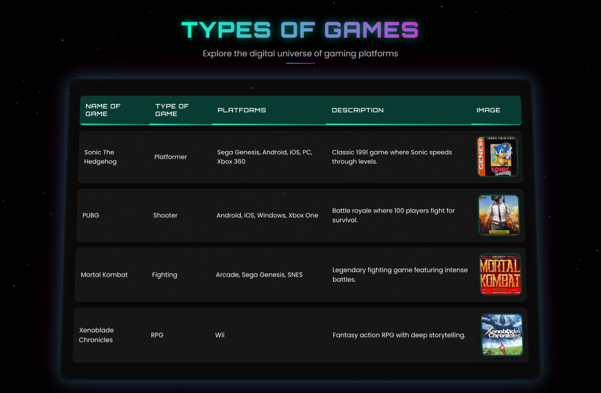

# 🎮 Futuristic Games Table

Futuristic Games Table is an interactive web application that showcases a variety of classic and modern games with a **futuristic UI design**. It features smooth animations, a dynamic 3D background powered by **Three.js**, and a **cyberpunk-inspired** aesthetic.

## 📌 Table of Contents
- [Installation](#installation)
- [Usage](#usage)
- [Features](#features)
- [Technologies Used](#technologies-used)
- [Contributing](#contributing)
- [License](#license)
- [Credits](#credits)

---

## 🚀 Installation

To set up the project locally, follow these steps:

# Clone the repository
git clone https://github.com/yourusername/futuristic-games-table.git

# Navigate to the project folder
cd futuristic-games-table

# Open index.html in your web browser
open index.html  # For macOS
start index.html # For Windows
xdg-open index.html # For Linux

🎮 Usage
Simply open index.html in your preferred web browser to explore the interactive table. You will find:

A dynamic list of games, including their type, platform, description, and images.
Interactive animations and hover effects for an engaging experience.

✨ Features
✔️ Interactive Game Table – Displays different games with their platforms & descriptions.
✔️ 3D Dynamic Background – Created using Three.js for a futuristic look.
✔️ Smooth GSAP Animations – Ensuring seamless transitions and hover effects.
✔️ Responsive Design – Works well on both desktop and mobile devices.
✔️ Glassmorphism UI – Uses backdrop filters and transparency for a modern feel.
✔️ Cyberpunk-Inspired Theme – Neon gradients and glowing UI elements.

🔧 Technologies Used
HTML5 – Structure and content.
CSS3 – Advanced animations, glass morphism, and 3D transforms.
JavaScript (ES6+) – Handles interactivity.
Three.js – WebGL-powered 3D particle background.
GSAP (GreenSock) – Smooth animations and transitions.
Google Fonts – Uses "Poppins" and "Orbitron" for a futuristic feel.

🙏 Credits
Three.js for the 3D particle background.
GSAP for smooth animations.
Google Fonts for the "Poppins" and "Orbitron" fonts.

📜 License
This project is licensed under the MIT License. See the LICENSE file for more details.
